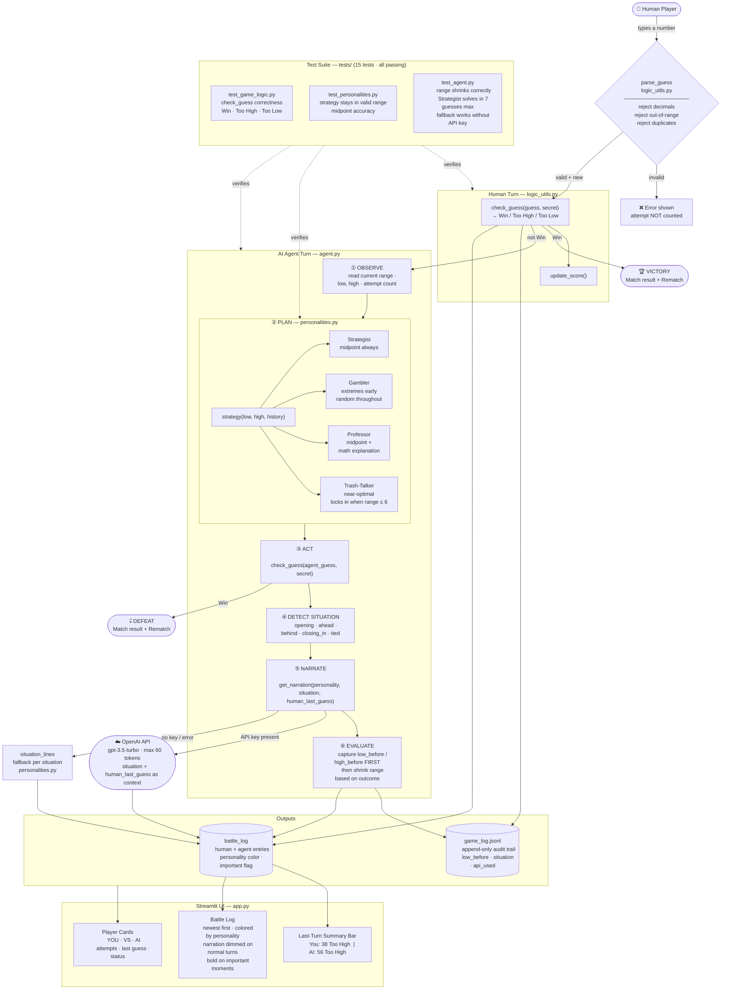

# Number Duel — Human vs AI Number Guessing Game

---

## Original Project (Modules 1–3)

The original project was called **Game Glitch Investigator**. It was a deliberately broken number guessing game built in Streamlit. The goal was to identify and fix three hidden bugs: the hint logic had reversed comparisons (`<` and `>` flipped), the attempt counter was initialized to `1` instead of `0` causing off-by-one errors throughout, and the guess was compared to the secret as a string instead of an integer, making even-attempt hints randomly wrong. After fixing those bugs and moving the logic into `logic_utils.py`, the project had a working game backed by a pytest suite.

---

## Title and Summary

**Number Duel** is a competitive number guessing game where a human player races against a personality-driven AI opponent in real time. Both players are given the same secret number and the same attempt limit. The human guesses first each turn, then the AI takes its turn. The first to guess correctly wins.

The AI is not just a chatbot attached to the side — it runs a structured **agentic loop** on every turn (observe the search range, plan a guess using a Python strategy, check the result, detect the game situation, generate in-character commentary, then update its range). Four distinct AI personalities each play differently: The Strategist always picks the mathematical midpoint, The Gambler swings toward the extremes early and stays chaotic, The Professor uses binary search and explains the math condescendingly, and The Trash-Talker plays near-optimally but locks in when closing and reacts directly to what you just did.

---

## Architecture Overview

The system is split into five modules with strict separation: the UI layer (`app.py`) orchestrates the game loop and session state, game logic (`logic_utils.py`) is pure functions with no dependencies, the agent (`agent.py`) runs the agentic loop and routes narration, personalities (`personalities.py`) are pure Python strategy functions plus system prompts, and the logger (`logger.py`) appends every turn to `game_log.jsonl`. The OpenAI API is optional — the game runs in fallback mode with canned situation-specific lines when no key is set.



**Where humans and testing are involved:**
- The **human** is in the loop every turn — they read the battle log, interpret the AI's narration and last guess, and decide their next number
- **pytest** verifies that hints are correct, that no strategy ever guesses outside its valid range, and that the agent solves a 1–100 game in at most 7 guesses
- **Runtime guardrails** protect the loop: input validation blocks bad guesses before they count, API failures fall back to canned lines, and `game_log.jsonl` records every turn for inspection

---

## Setup Instructions

**1. Install dependencies**

```bash
pip install -r requirements.txt
```

**2. Set your OpenAI API key** *(optional — the game works without it)*

```bash
# Mac / Linux
export OPENAI_API_KEY=sk-...

# Windows Command Prompt
set OPENAI_API_KEY=sk-...
```

Without a key, the AI still plays and still narrates — it uses built-in situation-specific fallback lines instead of calling the API. It never crashes.

**3. Run the app**

```bash
streamlit run app.py
```

**4. Run the tests**

```bash
pytest
```

Expected output: `15 passed`.

---

## Sample Interactions

### Example 1 — Human wins against The Strategist (Normal, secret = 73)

```
You:        50  →  Too Low
Strategist: 50  →  Too Low   "Starting at the midpoint. The math is on my side."
You:        75  →  Too High
Strategist: 75  →  Too High  "Anomaly. Recalibrating. Don't get comfortable."
You:        62  →  Too Low
Strategist: 62  →  Too Low   [no narration — normal turn]
You:        68  →  Too Low
Strategist: 68  →  Too Low   [no narration]
You:        73  →  WIN 🏆

VICTORY — You found it before The Strategist.
Secret: 73  |  Your guesses: 5  |  AI guesses: 4
```

*The Strategist was one guess ahead in efficiency but the human hit the number first.*

---

### Example 2 — AI wins against The Trash-Talker (Normal, secret = 37)

```
You:          75  →  Too High
Trash-Talker: 88  →  Too High  "First guess. Already more confident than you'll ever be."
You:          50  →  Too High
Trash-Talker: 44  →  Too High  [narration hidden — normal turn]
You:          25  →  Too Low
Trash-Talker: 40  →  Too High  "I've boxed it in. You're running out of room."
You:          37  →  WIN — wait, same turn...
Trash-Talker: 37  →  WIN

DEFEAT — The Trash-Talker found it first.
Secret: 37  |  Your guesses: 4  |  AI guesses: 4
```

*Both found it on turn 4, but the human goes first — if the human had guessed 37 on their turn, they would have won. The Trash-Talker's near-optimal strategy kept pace throughout.*

---

### Example 3 — Gambler chaos (Easy 1–20, secret = 11)

```
You:      10  →  Too Low
Gambler:   2  →  Too Low   "Opening move — pure chaos, maximum confidence."
You:      15  →  Too High
Gambler:  19  →  Too High  [narration hidden]
You:      12  →  Too High
Gambler:   4  →  Too Low   [narration hidden]
You:      11  →  WIN 🏆

VICTORY — You found it before The Gambler.
Secret: 11  |  Your guesses: 4  |  AI guesses: 3
```

*The Gambler's extreme-biased early guesses (2, 19) wasted moves the Strategist would never have made. The human's methodical narrowing won easily.*

---

## Design Decisions

**Why is the LLM only the voice, not the decision-maker?**
Letting the LLM choose the number would make strategy unpredictable and untestable. By keeping strategy as pure Python functions, every personality's behavior can be verified with pytest — the Strategist is guaranteed to solve in at most 7 guesses, and no strategy can ever guess outside its valid range. The LLM handles character voice only.

**Why is the OpenAI key optional?**
Requiring an API key to run creates a hard dependency that breaks demos, classrooms, and offline environments. The fallback `situation_lines` dict on each personality gives context-aware responses (opening, ahead, behind, closing_in) without any API call. The game is fully playable either way.

**Why capture `low_before` / `high_before` before EVALUATE, not after?**
The log should record the state the agent was in *when it made the guess*, not the state after narrowing. Logging post-mutation would make analytics misleading — a guess of 50 into range [1, 100] should not appear in the log as low_before=51.

**Why reject floats instead of silently truncating?**
Silently converting `60.9` to `60` breaks the fairness contract — the player typed something that isn't a valid integer and the game should say so. Guessing `5659` in a 1–100 game should tell the player immediately rather than giving a hint that wastes their attempt.

**Why show narration on every turn but style it differently?**
Showing narration only on "important" turns made it feel absent — most turns showed nothing. Showing it on every turn but dimming normal turns (70% opacity, normal weight) and highlighting important ones (100% opacity, bold) lets the AI feel present without being noisy.

**Trade-off: personality color vs. uniform styling**
Each personality has a stored hex color that drives its card border, attempt number, log tag, and narration text. This makes visual identification instant — you don't need to read the name to know if it's the Strategist or the Trash-Talker. The cost is that the CSS is more dynamic (inline styles per entry) but the UX benefit is worth it.

---

## Testing Summary

**Results:** 15 out of 15 tests passed across three test files. The agent reliably solves any 1–100 secret in 7 or fewer guesses. Fallback narration works correctly without an API key — zero crashes in offline mode. The one reliability gap found: `parse_guess` silently truncated floats before an explicit rejection rule was added, and this was caught by code review rather than tests.

**What worked:**

The test suite gave a clear contract before writing any code. `test_strategist_solves_normal_within_7` is the strongest test — it verifies not just that the algorithm is correct but that it terminates efficiently for any secret in a 1–100 range. `test_guess_always_in_range` running 20 iterations of TrashTalker (the only strategy with jitter) catches any clamping bug reliably.

`test_fallback_narration_when_no_api_key` temporarily removes `OPENAI_API_KEY` from the environment and confirms the game continues — this is the kind of test that prevents silent regressions where someone adds an API call path that crashes in offline environments.

**What didn't work initially:**

The agent log was recording `low_before` and `high_before` after the EVALUATE step had already mutated the state. Tests didn't catch this because they verify game outcomes (range shrinks, win condition) not log accuracy. It was caught by code review — a reminder that tests verify behavior, not internal bookkeeping.

The `parse_guess` function silently truncated floats (`60.9 → 60`) and accepted numbers far outside the game range. Tests never called `parse_guess` directly so this went undetected until the review flagged it as a fairness bug.

**What I learned:**

Separating logic into pure functions (`logic_utils.py`, `personalities.py`) makes testing trivial — no mocking, no Streamlit state, just inputs and outputs. The parts that are hardest to test (UI, session state, API calls) are also the parts most likely to have subtle bugs. Keeping them thin and pushing logic into pure modules is the most effective guardrail.

---

## Reflection

Building this project clarified something important about agentic AI systems: the LLM is a voice, not a brain. The decisions — which number to guess, when to narrow the range, how to detect if the AI is ahead or behind — are all deterministic Python. The LLM makes the output feel alive, but it cannot be trusted with correctness. That separation is what makes the system testable and reliable.

The experience of designing situation-aware commentary (opening, ahead, behind, closing_in) also showed that context matters more than personality. A Trash-Talker line that says "Fewer guesses than you. Let that sink in." only works because the system detected who's actually ahead — without that state signal, the commentary is generic and breaks immersion instantly.

The biggest shift in how I think about problem-solving is: define failure before you define success. Writing tests first (`test_strategist_solves_normal_within_7`, `test_fallback_narration_when_no_api_key`) made every implementation decision clearer because there was a concrete pass/fail target. That habit — turning requirements into verifiable assertions before touching implementation — is the most transferable thing this project taught me.
