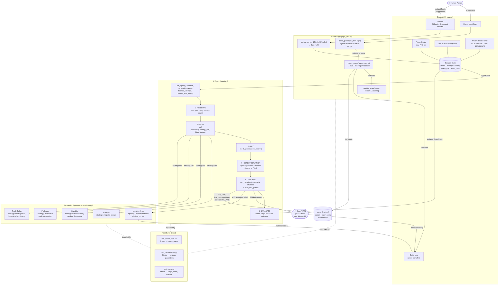
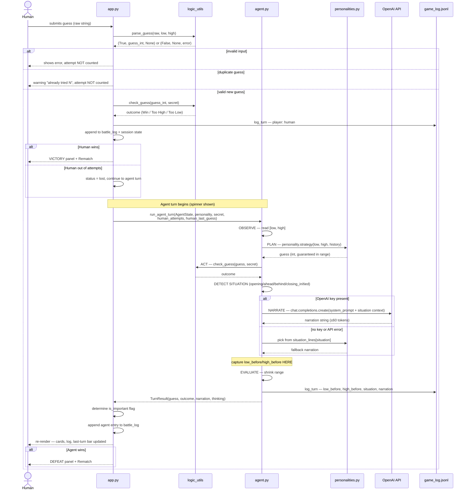
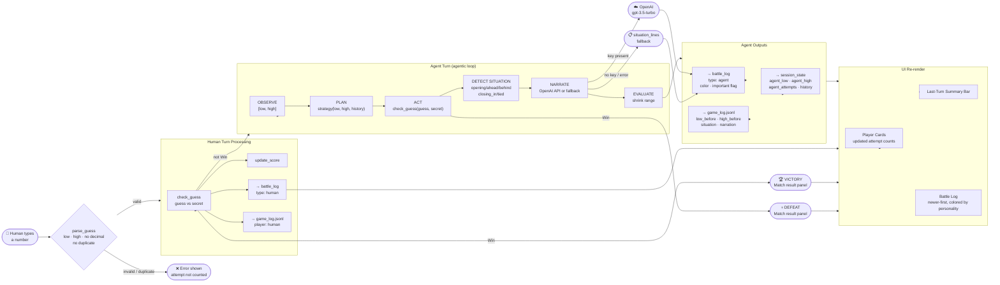
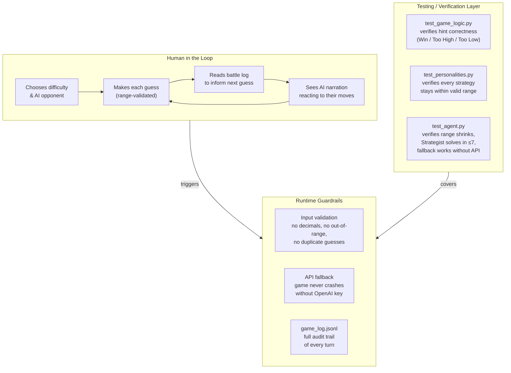

# System Architecture — Number Duel

Three diagrams covering different levels of the system:

1. [Component Map](#1-component-map) — what the modules are and how they connect
2. [Agent Turn Sequence](#2-agent-turn-sequence) — the agentic loop step by step
3. [Full Data Flow](#3-full-data-flow) — one complete round from input to output

---

## 1. Component Map

Shows every module, external service, and file, and the dependency edges between them.

---

## 2. Agent Turn Sequence

Shows the exact sequence of calls during a single AI turn, including the human move that triggers it.

---

## 3. Full Data Flow

Traces data from the moment the human types a guess to every place that data ends up.

---

## Component Responsibilities Summary

| Component | Responsibility | Has Side Effects |
|---|---|---|
| `app.py` | UI rendering, session state, game loop orchestration | Writes to session state, calls `log_turn` |
| `logic_utils.py` | Pure functions: parse, check, score, range | None |
| `agent.py` | Agentic turn loop, situation detection, narration routing | Mutates `AgentState`, calls `log_turn`, calls OpenAI |
| `personalities.py` | Strategy functions (pure Python) + system prompts + fallback lines | None |
| `logger.py` | Appends JSON entries to `game_log.jsonl` | Writes to disk |
| `tests/` | Verifies logic, strategy guarantees, agent behavior, API fallback | None (read-only) |
| `game_log.jsonl` | Append-only audit log of every human and AI turn | Persisted to disk |
| OpenAI API | Generates character-voice narration given situation context | External network call |

## Where Humans and Testing Are Involved

